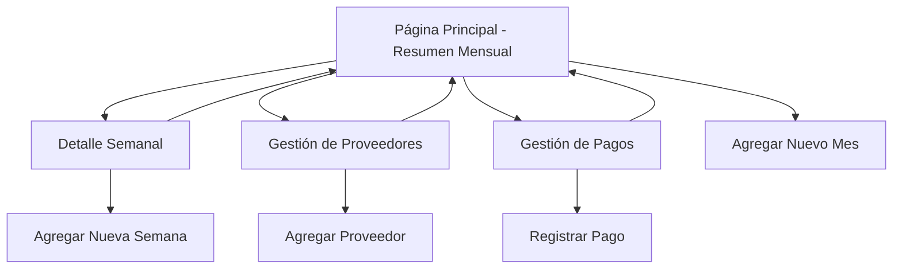

# Documento de Requerimientos del Producto - Sistema de Gestión de Créditos

## 1. Descripción General del Producto

Sistema web para la gestión y seguimiento de créditos que permite registrar información mensual y desglosarla por semanas, incluyendo gestión de proveedores y pagos.

El producto resuelve la necesidad de organizar y controlar créditos de manera estructurada, permitiendo a usuarios llevar un registro detallado de sus operaciones crediticias con una interfaz intuitiva basada en paneles.

Objetivo: Proporcionar una herramienta completa para el control financiero de créditos con capacidad de análisis temporal y gestión de relaciones comerciales.

## 2. Características Principales

### 2.1 Roles de Usuario

| Rol | Método de Registro | Permisos Principales |
|-----|-------------------|---------------------|
| Usuario Principal | Acceso directo (sin registro) | Puede crear, editar y eliminar todos los registros de créditos, proveedores y pagos |

### 2.2 Módulo de Características

Nuestros requerimientos del sistema de gestión de créditos consisten en las siguientes páginas principales:

1. **Página Principal**: resumen mensual de créditos, navegación principal, botón de agregar nuevo mes.
2. **Página de Detalle Semanal**: desglose semanal por mes seleccionado, navegación de regreso, botón de agregar nueva semana.
3. **Página de Gestión de Proveedores**: lista de proveedores, formulario de registro, asociación con créditos.
4. **Página de Gestión de Pagos**: registro de pagos realizados, cálculo de totales, historial de transacciones.

### 2.3 Detalles de Páginas

| Nombre de Página | Nombre del Módulo | Descripción de Características |
|------------------|-------------------|--------------------------------|
| Página Principal | Resumen Mensual | Mostrar lista de meses con totales de créditos, navegación intuitiva hacia detalles semanales |
| Página Principal | Botón Agregar | Permitir agregar nuevo registro mensual con monto total de crédito |
| Detalle Semanal | Desglose Semanal | Mostrar créditos por semana del mes seleccionado, navegación clara de regreso |
| Detalle Semanal | Gestión Semanal | Agregar nuevos registros de crédito para semanas específicas |
| Gestión de Proveedores | Lista de Proveedores | Mostrar, crear y editar información de proveedores |
| Gestión de Proveedores | Asociación de Créditos | Campo de selección de proveedor en formularios de crédito |
| Gestión de Pagos | Registro de Pagos | Crear y gestionar registros de pagos realizados |
| Gestión de Pagos | Cálculo de Totales | Mostrar totales y saldos pendientes después de pagos |

## 3. Proceso Principal

**Flujo Principal del Usuario:**

1. El usuario accede a la página principal y visualiza el resumen mensual de créditos
2. Puede agregar un nuevo mes con su monto total usando el botón "+"
3. Al seleccionar un mes específico, navega al detalle semanal
4. En la vista semanal, puede ver el desglose por semanas y agregar nuevos registros semanales
5. Puede gestionar proveedores desde una sección dedicada
6. Puede registrar pagos y ver totalizaciones en la sección de pagos
7. La navegación permite regresar fácilmente entre vistas

## 4. Diseño de Interfaz de Usuario

### 4.1 Estilo de Diseño

- **Colores primarios**: Azul (#3B82F6) para elementos principales, Verde (#10B981) para acciones positivas
- **Colores secundarios**: Gris (#6B7280) para texto secundario, Blanco (#FFFFFF) para fondos
- **Estilo de botones**: Redondeados con sombras suaves, efecto hover
- **Fuente**: Inter o system-ui, tamaños 14px-24px según jerarquía
- **Estilo de layout**: Basado en tarjetas/paneles con espaciado generoso
- **Iconos**: Heroicons o Lucide para consistencia, estilo outline

### 4.2 Resumen de Diseño de Páginas

| Nombre de Página | Nombre del Módulo | Elementos de UI |
|------------------|-------------------|----------------|
| Página Principal | Resumen Mensual | Tarjetas con mes y monto, colores azul/blanco, tipografía clara, botón "+" flotante verde |
| Detalle Semanal | Desglose Semanal | Lista de semanas en tarjetas, navegación breadcrumb, botón de regreso, animaciones suaves |
| Gestión de Proveedores | Lista de Proveedores | Tabla responsive, formularios modales, campos de búsqueda, validación en tiempo real |
| Gestión de Pagos | Registro de Pagos | Formularios estructurados, totalizadores destacados, historial en tabla, indicadores de estado |

### 4.3 Responsividad

Diseño mobile-first con adaptación a desktop. Optimizado para interacción táctil en dispositivos móviles, con elementos de navegación accesibles y formularios adaptados a pantallas pequeñas.