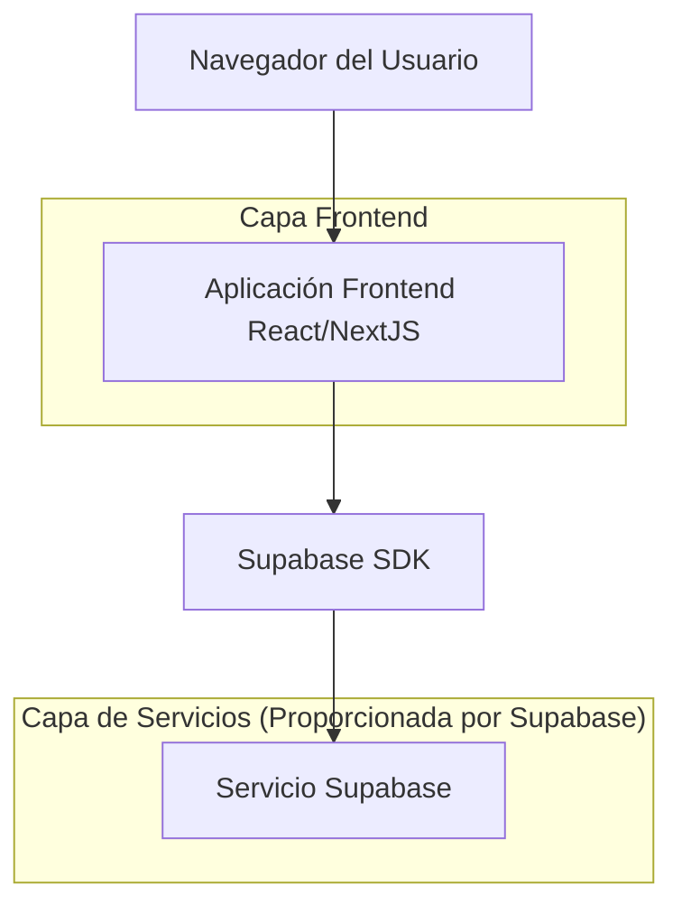
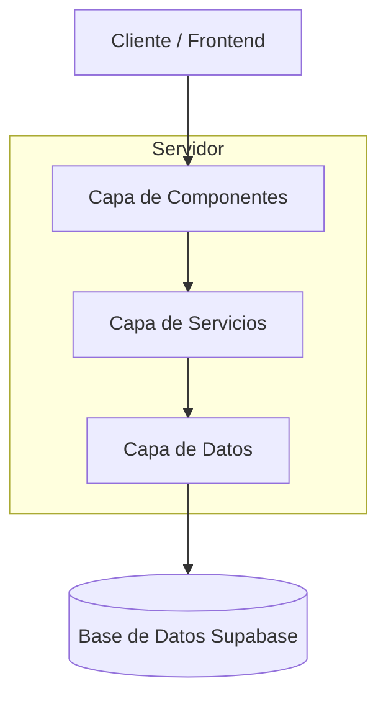
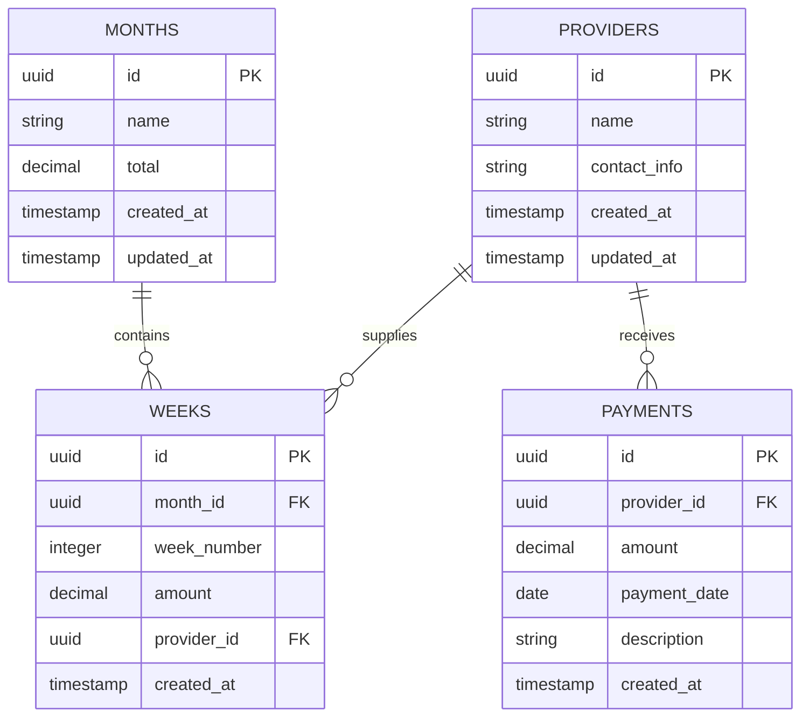

# Documento de Arquitectura Técnica - Sistema de Gestión de Créditos

## 1. Diseño de Arquitectura



## 2. Descripción de Tecnologías

- Frontend: NextJS@14 + React@18 + TailwindCSS@3 + TypeScript
- Backend: Supabase (PostgreSQL + Auth + Storage)
- Estado: React Context API + useState/useEffect hooks
- Validación: Zod para validación de formularios
- Iconos: Heroicons

## 3. Definiciones de Rutas

| Ruta | Propósito |
|------|----------|
| / | Página principal, muestra el resumen mensual de créditos |
| /month/[id] | Página de detalle semanal para un mes específico |
| /providers | Página de gestión de proveedores |
| /payments | Página de gestión de pagos |
| /add-month | Modal/página para agregar nuevo mes |
| /add-week/[monthId] | Modal/página para agregar nueva semana |

## 4. Definiciones de API

### 4.1 API Principal

**Gestión de Créditos Mensuales**
```
GET /api/months
```

Respuesta:
| Nombre del Parámetro | Tipo de Parámetro | Descripción |
|---------------------|-------------------|-------------|
| id | string | ID único del mes |
| name | string | Nombre del mes (ej: "Mayo 2024") |
| total | number | Total de créditos del mes |
| created_at | string | Fecha de creación |

Ejemplo:
```json
[
  {
    "id": "uuid-1",
    "name": "Mayo 2024",
    "total": 323,
    "created_at": "2024-05-01T00:00:00Z"
  }
]
```

**Gestión de Créditos Semanales**
```
GET /api/weeks?monthId={monthId}
```

Respuesta:
| Nombre del Parámetro | Tipo de Parámetro | Descripción |
|---------------------|-------------------|-------------|
| id | string | ID único de la semana |
| week_number | number | Número de semana (1-4) |
| amount | number | Monto de crédito de la semana |
| month_id | string | ID del mes al que pertenece |
| provider_id | string | ID del proveedor asociado |

**Gestión de Proveedores**
```
POST /api/providers
```

Solicitud:
| Nombre del Parámetro | Tipo de Parámetro | Requerido | Descripción |
|---------------------|-------------------|-----------|-------------|
| name | string | true | Nombre del proveedor |
| contact_info | string | false | Información de contacto |

**Gestión de Pagos**
```
POST /api/payments
```

Solicitud:
| Nombre del Parámetro | Tipo de Parámetro | Requerido | Descripción |
|---------------------|-------------------|-----------|-------------|
| amount | number | true | Monto del pago |
| provider_id | string | true | ID del proveedor |
| payment_date | string | true | Fecha del pago |
| description | string | false | Descripción del pago |

## 5. Diagrama de Arquitectura del Servidor



## 6. Modelo de Datos

### 6.1 Definición del Modelo de Datos



### 6.2 Lenguaje de Definición de Datos

**Tabla de Meses (months)**
```sql
-- crear tabla
CREATE TABLE months (
    id UUID PRIMARY KEY DEFAULT gen_random_uuid(),
    name VARCHAR(100) NOT NULL,
    total DECIMAL(10,2) NOT NULL DEFAULT 0,
    created_at TIMESTAMP WITH TIME ZONE DEFAULT NOW(),
    updated_at TIMESTAMP WITH TIME ZONE DEFAULT NOW()
);

-- crear índices
CREATE INDEX idx_months_created_at ON months(created_at DESC);
CREATE INDEX idx_months_name ON months(name);

-- permisos Supabase
GRANT SELECT ON months TO anon;
GRANT ALL PRIVILEGES ON months TO authenticated;
```

**Tabla de Semanas (weeks)**
```sql
-- crear tabla
CREATE TABLE weeks (
    id UUID PRIMARY KEY DEFAULT gen_random_uuid(),
    month_id UUID NOT NULL,
    week_number INTEGER NOT NULL CHECK (week_number >= 1 AND week_number <= 4),
    amount DECIMAL(10,2) NOT NULL,
    provider_id UUID,
    created_at TIMESTAMP WITH TIME ZONE DEFAULT NOW()
);

-- crear índices
CREATE INDEX idx_weeks_month_id ON weeks(month_id);
CREATE INDEX idx_weeks_provider_id ON weeks(provider_id);
CREATE INDEX idx_weeks_created_at ON weeks(created_at DESC);

-- permisos Supabase
GRANT SELECT ON weeks TO anon;
GRANT ALL PRIVILEGES ON weeks TO authenticated;
```

**Tabla de Proveedores (providers)**
```sql
-- crear tabla
CREATE TABLE providers (
    id UUID PRIMARY KEY DEFAULT gen_random_uuid(),
    name VARCHAR(255) NOT NULL,
    contact_info TEXT,
    created_at TIMESTAMP WITH TIME ZONE DEFAULT NOW(),
    updated_at TIMESTAMP WITH TIME ZONE DEFAULT NOW()
);

-- crear índices
CREATE INDEX idx_providers_name ON providers(name);
CREATE INDEX idx_providers_created_at ON providers(created_at DESC);

-- permisos Supabase
GRANT SELECT ON providers TO anon;
GRANT ALL PRIVILEGES ON providers TO authenticated;
```

**Tabla de Pagos (payments)**
```sql
-- crear tabla
CREATE TABLE payments (
    id UUID PRIMARY KEY DEFAULT gen_random_uuid(),
    provider_id UUID NOT NULL,
    amount DECIMAL(10,2) NOT NULL,
    payment_date DATE NOT NULL,
    description TEXT,
    created_at TIMESTAMP WITH TIME ZONE DEFAULT NOW()
);

-- crear índices
CREATE INDEX idx_payments_provider_id ON payments(provider_id);
CREATE INDEX idx_payments_payment_date ON payments(payment_date DESC);
CREATE INDEX idx_payments_created_at ON payments(created_at DESC);

-- permisos Supabase
GRANT SELECT ON payments TO anon;
GRANT ALL PRIVILEGES ON payments TO authenticated;

-- datos iniciales
INSERT INTO providers (name, contact_info) VALUES 
('Proveedor Ejemplo 1', 'contacto@proveedor1.com'),
('Proveedor Ejemplo 2', 'contacto@proveedor2.com');
```